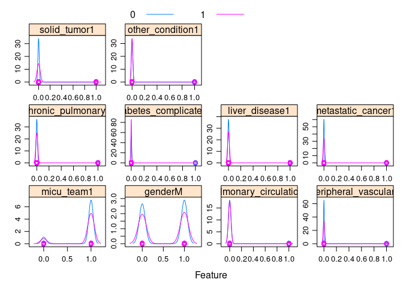

Instrumental Variable Example
================
Jeffrey Zhuohui Liang
7/25/2021

# Background

This example is a modification of the example in Textbook Chapter 19 and
its code\[1\].

We want to estimate the effect on ICU mortality of receiving care in a
non-target ICU( a ICU unit which have a different specialty focus than
ICU to which the patient should be assigned to in the absence of
capacity constrains). In our example, we will focus on patient assigned
to “MED” medical ICU service whom designated to a non- Medical ICU
(MICU), and we define these patients as `boarder`.

Assumption: Patient using Medical service admission normally will
require a MICU unit. We want to look at the association of using other
ICUs instead of MICU for patients who normally require MICU and the
probability of death within 24 hours of discharge from ICU or death
during ICU stay.

We assume that the staff others than physicians of MICU team will change
according to the boarding status. As as result the boarder are typically
cared for by nurse and other staffs are more experience with for example
surgical patients and not familiar with the procedures of the other
wings of the ICU. Besides, communication, geographic distance can delay
the care in time from MICU’s physicians. It seems nature that boarder
will have a negative impact on outcomes.

we assume that the decision to board a patient is not random, i.e. the
patient’s severity and condition compared to other coming patients is
take into accounts. For example, assume that boarder increase mortality,
so the physicians decide to board less severe patient and increase the
survival of severe patient. But such decision is unobservable.

# Method

## Data Exploration

In this example, we filter the patient whom received “MED” services and
as such should be assigned to MICU. This help excluding any reason aside
from capacity constraints for a patients to be boarder in a non MICU
unit (Example from textbook: a postoperative subject in the surgical ICU
being transferred to MICU for persistent respiratory failure).

Whether a patient is cared by a `micu team` is our primary interest
predictor, but we assume that there is unobserved confounding that
related to both variable and outcome.So the number of `remaining beds`
in MICU is defined as our Instrumental Variable.

where `inboarders` that represent a MICU bed occupied by a non-MICU
patient at the time a MICU patient began their ICU stay and we also
determine whether the new MICU patient was assigned a bed outside the
geographic confines of the MICU, in which case they were classified as a
`boarder`.

Our instrument is controlled for `team census`(how many patients were
assigned to the MICU) size since there is an intuitive inverse
relationship between team census size and the number of remaining beds,
and it is conceivable that team census size could affect the outcome.

We can see that the actual remaining bed for Medical service patient is
the `capacity` - `no.of.inboarders`, and those whom actually designated
to MICU is the `patient coming(Team census)` - `no.of.boarders`.

We also control for :

and our outcome is expire `within_24_hour` of callout or during ICU
stay.

``` r
example_df = read_csv("data/example_data.csv") %>% 
  janitor::clean_names() %>% 
  select(
    micu_team,
    age,
    gender,
    oasis,
    remaining_beds,
    team_census,
    congestive_heart_failure:depression,
    num_icustay,
    icd9_code,
    within_24_hours
  ) %>%
  mutate(across(
    c(
      gender,
      congestive_heart_failure:depression,
      within_24_hours,
      micu_team,
      icd9_code
    ),
    as.factor
  ),
  age = case_when(age<100 ~ age,
                  age >= 100 ~ 89)) %>% # change integer to factor
  select_if(function(x)
    length(unique(x)) > 1)   # drop factors that have only 1 value


drop_col = example_df %>%  
  select(where(is.factor),-icd9_code) %>%
  apply(., 2, function(x)
    min(plyr::count(x)$freq)) %>% 
  .[.<=30] %>% 
  names()
# Combine condition that have less than 10 obervation in group into a combined group
example_df["other_condition"] = as.factor(apply(example_df[, drop_col], 1, function(x)
  max(as.numeric(x))))

# drop factors that contains less than 10 observation per groups
example_df = example_df[,!colnames(example_df) %in% drop_col]

example_df = example_df %>% 
  group_by(icd9_code) %>% 
  filter(n()>=5) %>% # we filter out drg group which has less than 10 observation
  ungroup()

  
skimr::skim_without_charts(example_df) # statistics of our example data
```

|                                                  |             |
|:-------------------------------------------------|:------------|
| Name                                             | example\_df |
| Number of rows                                   | 11531       |
| Number of columns                                | 17          |
| \_\_\_\_\_\_\_\_\_\_\_\_\_\_\_\_\_\_\_\_\_\_\_   |             |
| Column type frequency:                           |             |
| factor                                           | 12          |
| numeric                                          | 5           |
| \_\_\_\_\_\_\_\_\_\_\_\_\_\_\_\_\_\_\_\_\_\_\_\_ |             |
| Group variables                                  | None        |

Data summary

**Variable type: factor**

| skim\_variable         | n\_missing | complete\_rate | ordered | n\_unique | top\_counts                             |
|:-----------------------|-----------:|---------------:|:--------|----------:|:----------------------------------------|
| micu\_team             |          0 |              1 | FALSE   |         2 | 1: 9979, 0: 1552                        |
| gender                 |          0 |              1 | FALSE   |         2 | M: 6007, F: 5524                        |
| pulmonary\_circulation |          0 |              1 | FALSE   |         2 | 0: 11294, 1: 237                        |
| peripheral\_vascular   |          0 |              1 | FALSE   |         2 | 0: 11507, 1: 24                         |
| chronic\_pulmonary     |          0 |              1 | FALSE   |         2 | 0: 11464, 1: 67                         |
| diabetes\_complicated  |          0 |              1 | FALSE   |         2 | 0: 11506, 1: 25                         |
| liver\_disease         |          0 |              1 | FALSE   |         2 | 0: 11470, 1: 61                         |
| metastatic\_cancer     |          0 |              1 | FALSE   |         2 | 0: 11505, 1: 26                         |
| solid\_tumor           |          0 |              1 | FALSE   |         2 | 0: 11430, 1: 101                        |
| icd9\_code             |          0 |              1 | FALSE   |       356 | 038: 1286, 518: 626, 507: 439, 486: 406 |
| within\_24\_hours      |          0 |              1 | FALSE   |         2 | 0: 9540, 1: 1991                        |
| other\_condition       |          0 |              1 | FALSE   |         2 | 0: 11458, 1: 73                         |

**Variable type: numeric**

| skim\_variable  | n\_missing | complete\_rate |  mean |    sd |  p0 | p25 | p50 | p75 | p100 |
|:----------------|-----------:|---------------:|------:|------:|----:|----:|----:|----:|-----:|
| age             |          0 |              1 | 64.84 | 18.23 |  15 |  52 |  67 |  81 |   89 |
| oasis           |          0 |              1 | 33.12 |  9.53 |   9 |  26 |  32 |  39 |   69 |
| remaining\_beds |          0 |              1 |  5.98 |  1.52 |   0 |   5 |   6 |   7 |    8 |
| team\_census    |          0 |              1 |  1.41 |  1.26 |   0 |   0 |   1 |   2 |    8 |
| num\_icustay    |          0 |              1 |  2.16 |  2.19 |   1 |   1 |   1 |   2 |   52 |

``` r
# test the association of outcome and variable of interest
chisq.test(example_df$within_24_hours,example_df$micu_team) 
```

    ## 
    ##  Pearson's Chi-squared test with Yates' continuity correction
    ## 
    ## data:  example_df$within_24_hours and example_df$micu_team
    ## X-squared = 1.8, df = 1, p-value = 0.2

``` r
# test the association of intrumental variable and variable of interest
t.test(formula = remaining_beds~micu_team,data = example_df)
```

    ## 
    ##  Welch Two Sample t-test
    ## 
    ## data:  remaining_beds by micu_team
    ## t = 64, df = 3525, p-value <2e-16
    ## alternative hypothesis: true difference in means is not equal to 0
    ## 95 percent confidence interval:
    ##  1.567 1.666
    ## sample estimates:
    ## mean in group 0 mean in group 1 
    ##           7.378           5.761

``` r
# test the assocaition of intrumental variable and outcome
t.test(formula = remaining_beds~within_24_hours,data = example_df)
```

    ## 
    ##  Welch Two Sample t-test
    ## 
    ## data:  remaining_beds by within_24_hours
    ## t = -1, df = 2839, p-value = 0.3
    ## alternative hypothesis: true difference in means is not equal to 0
    ## 95 percent confidence interval:
    ##  -0.11363  0.03572
    ## sample estimates:
    ## mean in group 0 mean in group 1 
    ##           5.972           6.011

``` r
corrplot::corrplot(
  cor(example_df %>% select(where(is.numeric)))
)
```

<!-- -->

``` r
featurePlot(
  x = model.matrix(within_24_hours ~ .-icd9_code, example_df %>% select(where(is.factor)))[,-1],
  y = example_df$within_24_hours,
  scales = list(
    x = list(relation = "free"),
    y = list(relation = "free")
  ),
  plot = "density",
  auto.key = list(columns = 2.5)
)
```

<!-- -->

## Model analysis

``` r
### "Bias" estimation

md_bias = glm(within_24_hours ~ .-icd9_code,
              family = "binomial",
              data = example_df[,!colnames(example_df) %in% "remaining_beds"])

broom::tidy(md_bias) %>%
  head() %>%
  knitr::kable(digits = 4,
               caption = "Biased Model Log Odd ratio Estimatiom")
```

| term         | estimate | std.error | statistic | p.value |
|:-------------|---------:|----------:|----------:|--------:|
| (Intercept)  |  -6.4418 |    0.1797 |  -35.8463 |  0.0000 |
| micu\_team1  |  -0.2353 |    0.0864 |   -2.7224 |  0.0065 |
| age          |   0.0043 |    0.0017 |    2.5307 |  0.0114 |
| genderM      |   0.1059 |    0.0559 |    1.8957 |  0.0580 |
| oasis        |   0.1283 |    0.0034 |   38.1191 |  0.0000 |
| team\_census |  -0.0001 |    0.0240 |   -0.0051 |  0.9960 |

Biased Model Log Odd ratio Estimatiom

The coefficient we estimate is Logarithm of Odd Ratio(OR), so we need to
apply exponential if we want to inference on OR instead of Log Odd.

``` r
broom::tidy(md_bias) %>%
  mutate(
    lower = exp(estimate + qnorm(0.025) * std.error),
    upper = exp(estimate + qnorm(0.975) * std.error),
        estimate = exp(estimate)
  ) %>%
  relocate(term, lower, estimate, upper) %>% 
  head() %>% 
  knitr::kable(digits = 4,
               caption = "Biased Model Odd ratio Estimatiom")
```

| term         |  lower | estimate |  upper | std.error | statistic | p.value |
|:-------------|-------:|---------:|-------:|----------:|----------:|--------:|
| (Intercept)  | 0.0011 |   0.0016 | 0.0023 |    0.1797 |  -35.8463 |  0.0000 |
| micu\_team1  | 0.6671 |   0.7903 | 0.9362 |    0.0864 |   -2.7224 |  0.0065 |
| age          | 1.0010 |   1.0043 | 1.0076 |    0.0017 |    2.5307 |  0.0114 |
| genderM      | 0.9964 |   1.1117 | 1.2403 |    0.0559 |    1.8957 |  0.0580 |
| oasis        | 1.1294 |   1.1368 | 1.1444 |    0.0034 |   38.1191 |  0.0000 |
| team\_census | 0.9539 |   0.9999 | 1.0481 |    0.0240 |   -0.0051 |  0.9960 |

Biased Model Odd ratio Estimatiom

## Instumental Analysis

In economics analysis, 2-stage-least-square(2SLS) is used to estimate
the adjusted effects of endogenuous variables. But the estimation is
different if we consider categorical outcome and predictors. Detailed of
estimation method is listed in the reference\[2\]. We will use `ivtools`
packages\[3\] for this example.

``` r
confounders = paste0(
  colnames(example_df)[!colnames(example_df) %in% c("micu_team","remaining_beds","within_24_hours","icd9_code")],
  collapse = "+")

stage_1  = as.formula(
  paste0("micu_team~remaining_beds+",confounders)
)

stage_2 = as.formula(
  paste0("within_24_hours~micu_team+",confounders)
)

md_ivtools =
  ivtools::ivglm(
    estmethod = "ts",
    fitX.LZ = glm(stage_1, family = "binomial", data = example_df),
    fitY.LX = glm(stage_2,
                  family = "binomial",
                  data = example_df),
    data = example_df
  )

bind_cols(rownames(summary(md_ivtools)$coeff), as_tibble(summary(md_ivtools)$coeff))  %>%
  rename(term = `...1`) %>% 
  janitor::clean_names() %>% 
  mutate(
    lower = exp(estimate + qnorm(0.025) * std_error),
    upper = exp(estimate + qnorm(0.975) * std_error),
    estimate = exp(estimate)
  ) %>%
  relocate(term, lower, estimate, upper) %>%
  head() %>% 
  knitr::kable(digits = 4,
               caption = "Intrumental Variable Model Odd ratio Estimatiom")
```

| term         |  lower | estimate |  upper | std\_error | z\_value |  pr\_z |
|:-------------|-------:|---------:|-------:|-----------:|---------:|-------:|
| (Intercept)  | 0.0011 |   0.0018 | 0.0029 |     0.2507 | -25.2173 | 0.0000 |
| micu\_team   | 0.4015 |   0.6745 | 1.1334 |     0.2648 |  -1.4871 | 0.1370 |
| age          | 1.0010 |   1.0042 | 1.0074 |     0.0016 |   2.5896 | 0.0096 |
| genderM      | 0.9968 |   1.1115 | 1.2394 |     0.0556 |   1.9020 | 0.0572 |
| oasis        | 1.1288 |   1.1369 | 1.1451 |     0.0037 |  34.9323 | 0.0000 |
| team\_census | 0.9474 |   1.0152 | 1.0879 |     0.0353 |   0.4277 | 0.6689 |

Intrumental Variable Model Odd ratio Estimatiom

## Sparse Matrix

``` r
library(Matrix)

confounders = paste0(
  colnames(example_df)[!colnames(example_df) %in% c("micu_team","remaining_beds","within_24_hours")],
  collapse = "+")

stage_1  = as.formula(
  paste0("micu_team~remaining_beds+",confounders)
)

stage_2 = as.formula(
  paste0("within_24_hours~micu_team+",confounders,"+res")
)

### Bias Estimate
train_matrix = sparse.model.matrix(as.formula(paste0(
  "within_24_hours~micu_team+", confounders
)),
data = example_df)[, -1]

dim(train_matrix)
```

    ## [1] 11531  1201

``` r
glm_sparse_bias = glmnet::glmnet(
  x = train_matrix,
  y = example_df$within_24_hours,
  family = "binomial",
  nlambda = 1,
  type.logistic = "Newton",
  lambda = 0,
  maxit = 1e+4
)

broom::tidy(glm_sparse_bias) %>% 
  head(n=10) %>% 
  summarise(term = term,
            OR = exp(estimate)) %>% 
  knitr::kable(caption = "Sparse Matrix GLM- Bias estimate")
```

| term                    |      OR |
|:------------------------|--------:|
| (Intercept)             |  0.0015 |
| micu\_team1             |  0.7554 |
| age                     |  1.0023 |
| genderM                 |  1.0765 |
| oasis                   |  1.1244 |
| team\_census            |  0.9956 |
| pulmonary\_circulation1 | 63.0528 |
| peripheral\_vascular1   |  1.2115 |
| chronic\_pulmonary1     | 29.7286 |
| diabetes\_complicated1  |  0.0083 |

Sparse Matrix GLM- Bias estimate

``` r
### First Stage
train_matrix = sparse.model.matrix(stage_1,
                                   data = example_df)[, -1]

dim(train_matrix)
```

    ## [1] 11531  1201

``` r
glm_sparse_sg1 = glmnet::glmnet(
  x = train_matrix,
  y = example_df$within_24_hours,
  family = "binomial",
  nlambda = 1,
  type.logistic = "Newton",
  lambda = 0,
  maxit = 1e+4
)

res_sg1 = predict(glm_sparse_sg1,newx = train_matrix,type = "response")

res_sparse_sg1 = as.numeric(example_df$micu_team)- 1 - res_sg1

### Second Stage
stage_2_df = example_df

stage_2_df[, "res"] = res_sparse_sg1

glm_sparse_sg2 = glmnet::glmnet(
  x = sparse.model.matrix(stage_2, data = stage_2_df)[, -1],
  y = stage_2_df$within_24_hours,
  family = "binomial",
  nlambda = 1,
  type.logistic = "Newton",
  lambda = 0,
  maxit = 1e+4
)

broom::tidy(glm_sparse_sg2) %>% 
  head() %>% 
  summarise(term = term,
            OR = exp(estimate)) %>% 
  knitr::kable(caption = "Sparse Matrix GLM-IV estimate")
```

| term         |     OR |
|:-------------|-------:|
| (Intercept)  | 0.0024 |
| micu\_team1  | 1.2058 |
| age          | 1.0022 |
| genderM      | 1.0705 |
| oasis        | 1.1138 |
| team\_census | 0.9984 |

Sparse Matrix GLM-IV estimate

``` r
### Bootstrap estimate

IV_coef = list()

for(i in 1:100){
  train_matrix = sample_n(stage_2_df,
                        size = nrow(stage_2_df),
                        replace = T)
  
  glm_sparse_sg2 = glmnet::glmnet(
    x = sparse.model.matrix(stage_2,data = train_matrix)[,-1],
    y = train_matrix$within_24_hours,
    family = "binomial",
    nlambda = 1,
    type.logistic = "Newton",
    lambda = 0,
    maxit = 1e+4
  )
  
  IV_coef[[i]] = broom::tidy(glm_sparse_sg2)
}

IV_coef = do.call(bind_rows,IV_coef)

IV_coef %>% 
  filter(term %in% head(.)$term) %>% 
  group_by(term) %>% 
  summarise(bootstrap_lwr = exp(quantile(estimate,0.025)),
            bootstrap_upr = exp(quantile(estimate,0.975)),
            bootstrap_estimate = exp(mean(estimate)))  %>% 
  knitr::kable(caption = "Sparse Matrix bootstrap GLM-IV estimate")
```

| term         | bootstrap\_lwr | bootstrap\_upr | bootstrap\_estimate |
|:-------------|---------------:|---------------:|--------------------:|
| (Intercept)  |         0.0009 |         0.0051 |              0.0020 |
| age          |         0.9990 |         1.0062 |              1.0023 |
| genderM      |         0.9560 |         1.1932 |              1.0743 |
| micu\_team1  |         0.2389 |         4.7519 |              1.2143 |
| oasis        |         1.0833 |         1.1564 |              1.1165 |
| team\_census |         0.9354 |         1.0451 |              0.9955 |

Sparse Matrix bootstrap GLM-IV estimate

In this example, we can see that after adjusting unobserved confounding
in our variable of interest, the effect of variable of interest became
not statistically significant, compared to a statistically significant
protective effect in the unadjust model.

# Reference

\[1\]
<https://github.com/MIT-LCP/critical-data-book/tree/master/part_iii/chapter_19>

\[2\] <http://www-stat.wharton.upenn.edu/~dsmall/BCai2009_SIM_Final.pdf>

\[3\] <https://cran.r-project.org/web/packages/ivtools/ivtools.pdf>
